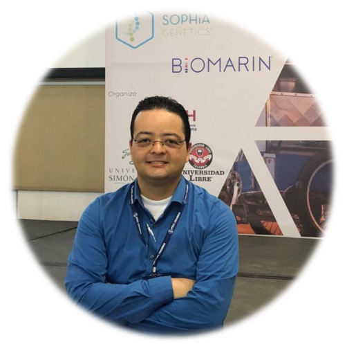

Estamos muy felices de presentar a los conferencistas del evento.

Gabriela de Queiroz  
Founder & CEO  @R-Ladies  
Sr. Developer Advocate (ML/DL/AI) @IBM  
Data Scientist + Speaker + Mentor + Advisor  
 

 
 

Mine Çetinkaya-Rundel  
Senior Lecturer, University of Edinburgh  
Data Scientist & Professional Educator, RStudio  
Associate Professor of the Practice, Duke University  
 

 
 

Jorge I. Vélez  
Profesor Asistente,  
Departamento de Ingeniería Industrial  
Universidad del Norte,  
Barranquilla, Colombia  
PhD in Medical Sciences (Genomics and Precision Medicine)  
Australian National University, Canberra, Australia  

