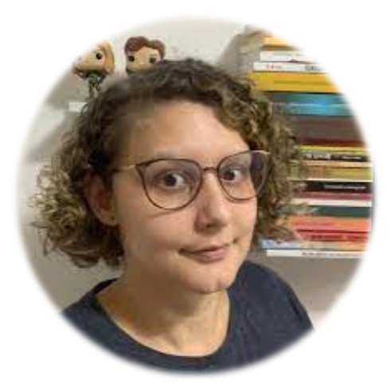
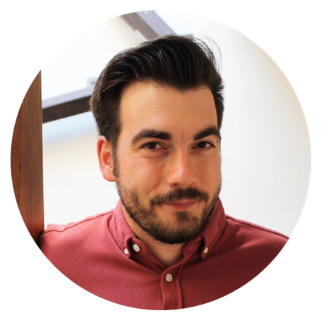
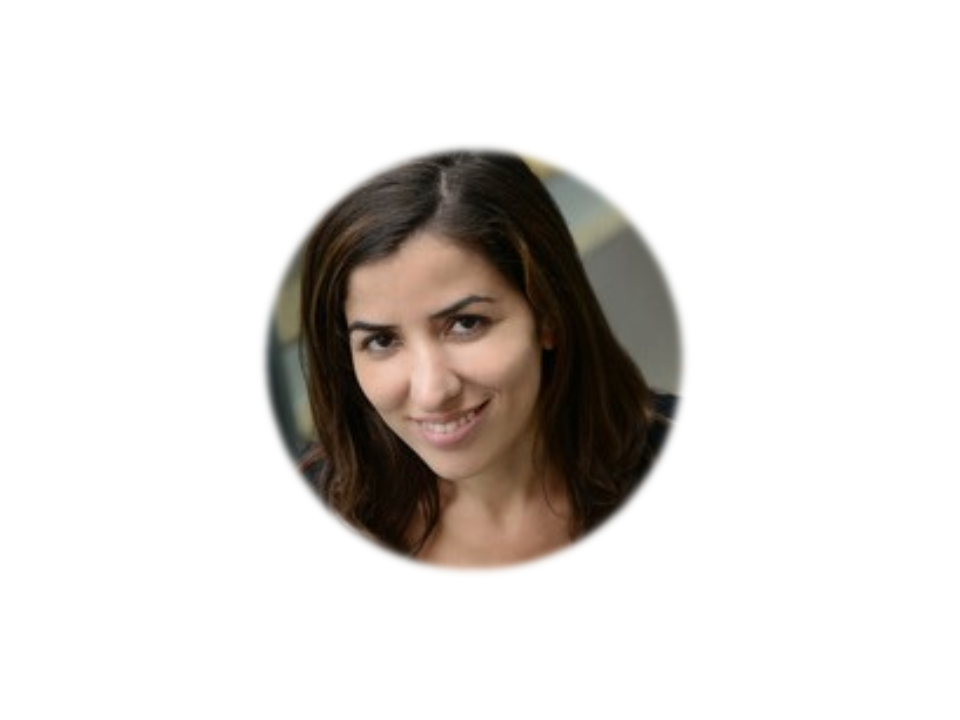
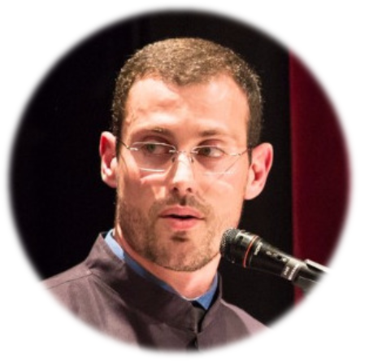
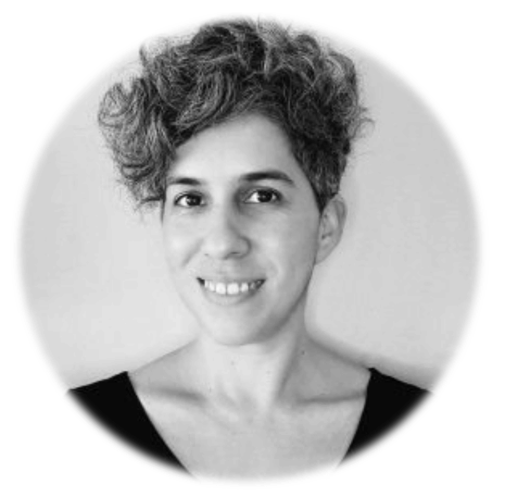

Estamos muy felices de presentar a los conferencistas que nos acompañaron de __forma virtual__ en el R Day. Debajo de cada foto podrá encontrar el video YouTube de la conferencia.

  
[Beatriz Milz](https://beamilz.com)  
Instructora certificada de tidyverse y profesora de [Curso-R](https://curso-r.com).  
  

 

<iframe width="560" height="315" src="https://www.youtube.com/embed/Oj9cwnXs_oo?si=sQPPv7C_MZjzuqp5" title="YouTube video player" frameborder="0" allow="accelerometer; autoplay; clipboard-write; encrypted-media; gyroscope; picture-in-picture; web-share" allowfullscreen></iframe>

 
 
 

  
[Miguel A. Sorrel](https://miguel-sorrel.github.io/personal_site)  
Assistant Professor in Methodology at the Autonomous University of Madrid.  
 

 

<iframe width="560" height="315" src="https://www.youtube.com/embed/ywmr9qCUWEU?si=IHMiML2AiQG1afPG" title="YouTube video player" frameborder="0" allow="accelerometer; autoplay; clipboard-write; encrypted-media; gyroscope; picture-in-picture; web-share" allowfullscreen></iframe>

 
 
 

  
[Paula Moraga](https://www.paulamoraga.com/)  
Assistant Professor of Statistics at King Abdullah University of Science and Technology (KAUST).  
 

 

<iframe width="560" height="315" src="https://www.youtube.com/embed/6ccX5cpy2VQ?si=0Y-o5L9gRjWOXGLB" title="YouTube video player" frameborder="0" allow="accelerometer; autoplay; clipboard-write; encrypted-media; gyroscope; picture-in-picture; web-share" allowfullscreen></iframe>

 
 
 

  
[Walmes Marques Zeviani](http://leg.ufpr.br/~walmes/home/)  
Assistant Professor of Statistics at UFPR & R programmer, Curitiba, Brasil.  
 

 

<iframe width="560" height="315" src="https://www.youtube.com/embed/HWgRgMBUqy4?si=sgR-RMk0UbBmn0bO" title="YouTube video player" frameborder="0" allow="accelerometer; autoplay; clipboard-write; encrypted-media; gyroscope; picture-in-picture; web-share" allowfullscreen></iframe>

 
 
 

  
[Riva Quiroga](https://rivaquiroga.cl/)  
Linguista y amante de trabajar con datos, Valparaiso, Chile.  
 

 

<iframe width="560" height="315" src="https://www.youtube.com/embed/gTd8aM6cgJA?si=98S_4_22uj-kNit2" title="YouTube video player" frameborder="0" allow="accelerometer; autoplay; clipboard-write; encrypted-media; gyroscope; picture-in-picture; web-share" allowfullscreen></iframe>

 
 
 

  
[Yanina Bellini Saibene](https://yabellini.netlify.app/)  
Educadora, creadora de comunidad e investigadora, La Pampa, Argentina.  
 

 

<iframe width="560" height="315" src="https://www.youtube.com/embed/iFf6v4SZvR0?si=fvZH-jc-9W488noK" title="YouTube video player" frameborder="0" allow="accelerometer; autoplay; clipboard-write; encrypted-media; gyroscope; picture-in-picture; web-share" allowfullscreen></iframe>

 
