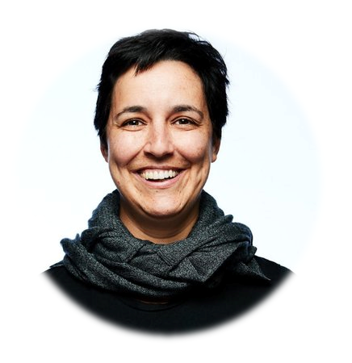

Estamos muy felices de presentar a los conferencistas del evento.

Gabriela de Queiroz  
Founder & CEO  @R-Ladies  
Sr. Developer Advocate (ML/DL/AI) @IBM  
Data Scientist + Speaker + Mentor + Advisor  
 

 
 

Mine Çetinkaya-Rundel  
Associate Professor of the Practice  
Director of Undergraduate Studies  
Department of Statistical Science, Duke University  
 

 
 

Jairo Fúquene  
Statistical consultant to Vital Strategies,  
on the Bloomberg Philanthropies Data for Health Initiative  

