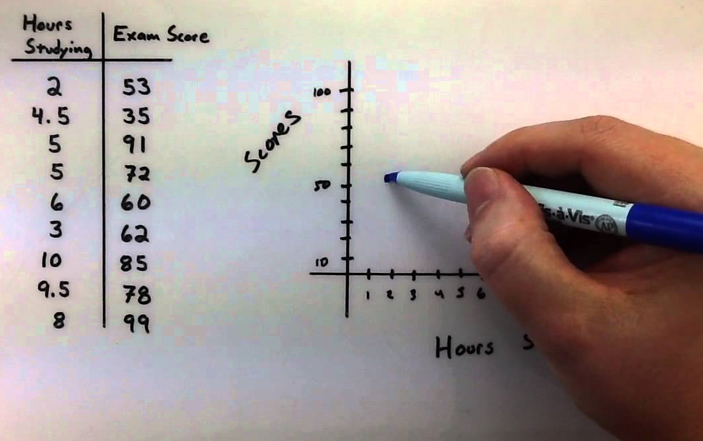

# Introducción
Las memorias del evento R Day estarán disponibles online para consultas posteriores. Para tener uniformidad en la presentación de los documentos, los autores deberán seguir las instrucciones dadas aquí. \newline

La introducción debe indicar el problema o tema abordado, su importancia, los antecedentes y el objetivo principal del estudio o propuesta. Adicionalmente, debe indicar el contenido del documento.

# Formato del texto
A continuación se dan recomendaciones para la elaboración del documento.

## Autores y filiación
Los nombres de los autores deben ir completos y con la filiación.

## email de contacto
Solo se debe colocar el correo electrónico del autor de contacto.

## Resultados
Indicar resultados relevantes según el objetivo propuesto.

## Secciones
Escriba las secciones que considere necesarias para presentar su trabajo. Para iniciar toda sección se debe usar la etiqueta `#` y luego el nombre de la sección, abajo un ejemplo.

```{r eval=FALSE}
# Nombre de seccion
```

Para crear sub-secciones en el documento se deben usar dos `##` y luego el nombre de la sub-sección, abajo un ejemplo.

```{r eval=FALSE}
## Nombre de sub-seccion
```

## Resultados
Indicar resultados relevantes según el objetivo propuesto.

# Elaboración de tablas

Para construir una tabla se deben tener en cuenta las siguientes recomendaciones. 

- Los números van centrados siempre que tengan la misma cantidad de dígitos, de lo contrario deben ir alineados con el margen derecho del título.
- Cuando las tablas tienen datos con cifras decimales, el número de éstas debe ser igual dentro de la misma columna, pudiendo variar de columna a columna. 
- Las tablas se deben nombrar en la parte superior.

La Tabla \ref{tabla:sencilla} mostrada a continuación se elaboró usando instrucciones usuales de LaTex.

\begin{table}[htbp]
\begin{center}
\caption{Nombre de la tabla completo.}
\begin{tabular}{l|l} \hline
Pais & Ciudad \\ \hline
Espana & Madrid \\ 
Espana & Sevilla \\ 
Francia & Paris \\ \hline
\end{tabular}
\label{tabla:sencilla}
\end{center}
\end{table}

# Incluyendo código de R
Es posible incluir código de R en este documento para ilustrar a los lectores en la forma de usar R para realizar algún procedimiento. Se recomienda a los autores [visitar este enlace](https://bookdown.org/yihui/rmarkdown/r-code.html) para conocer más detalles de como incluir código de R. \newline

A continuación un muestra un código de R que genera cien observaciones aleatorias de una normal y luego calcula la media muestral $\bar{x}$.

```{r fig.height=4, fig.width=5}
x <- rnorm(n=100, mean=70, sd=5)
mean(x)
```

# Elaboración de figuras
Toda figura debe ir centrada y el título debe ir en la parte inferior. \newline

Las figuras se pueden realizar con R. A continuación se muestran una figura creada dentro de este mismo archivo.

```{r mifig1, echo=FALSE, fig.cap="Histograma de valores simulados de una N(0, 1)", fig.width=5, fig.height=4}
hist(rnorm(100), main='No colocar el titulo aqui, colocarlo abajo',
     col='deepskyblue3', las=1)
```

Otra forma de incluir figuras es importándolas. A continuación un ejemplo de como incluir la Figura \ref{fig:mifig2}. La Figura \ref{fig:mifig2} se puede referenciar escribiendo `\ref{fig:mifig2}` dentro de comillas sencillas. 

```{r mifig2, echo=FALSE, fig.cap='Diagrama de dispersion hecho manualmente.', out.width = '50%', fig.align='center'}

```

# Ecuaciones
Para incluir ecuaciones dentro de un párrafo se usan `$ $` y dentro el símbolo deseado. Por ejemplo, para incluir la letra griega $\mu$ se escribió `$\mu$`. \newline 

Para incluir ecuaciones se pueden usar `$$ $$` y dentro la ecuación. La siguiente ecuación fue hecha usando `$$\mu = \frac{\theta}{\sigma}$$`.

$$\mu = \frac{\theta}{\sigma}$$
  
Otra forma de incluir ecuaciones es de la forma usual como se hace en latex, a continuación un ejemplo usando `\begin{equation}` y `\end{equation}`. La ventaja de esta última opción es que la ecuación \ref{energia} sale numerada y se puede citar luego usando `\ref{clave}`.

\begin{equation} \label{energia}
E = m c^2
\end{equation}

# Incluyendo referencias
Todas las referencias deben estar en el archivo `master.bib` para que se puedan invocar en el trabajo. Existen dos formas de citar y son:
  
1. Como cita directa, es decir como @xie2013ddrk. Para esto se debe escribir `@xie2013ddrk` y el archivo insertará automaticamente la referencia y la colocará en la última sección de Referencias.
2. Como cita indirecta o pasiva, es decir como [@xie2013ddrk]. Para esto se debe escribir `[@xie2013ddrk]` y el archivo insertará automaticamente la referencia y la colocará en la última sección de Referencias.

Para citar el lenguaje de programación @R se escribe `@R` y listo, la referencia quedará en el texto y en la sección final.


<!--
# References
\setlength{\parindent}{-0.2in}
\setlength{\leftskip}{0.2in}
\setlength{\parskip}{8pt}
\vspace*{-0.2in}
\noindent
-->

