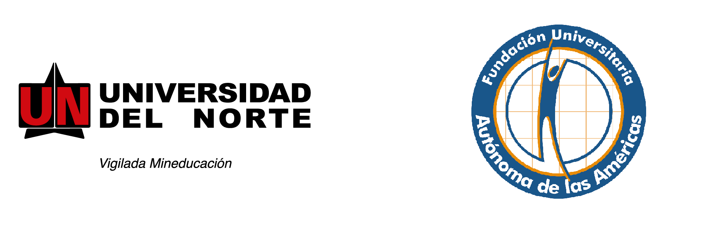

<h2> </h2>

Rday es un evento que ha tenido un impacto positivo en la comunidad científica y empresarial debido a la versatilidad del lenguaje de programación R. Este evento se ha realizado en diferentes ciudades del mundo, en esta ocasión se realizará por primera vez en Medellín. Con el Rday queremos integrar la comunidad de usuarios de R en la ciudad de Medellín y llamar la atención de quienes aún no lo conocen.

 

<iframe width="560" height="315" src="https://www.youtube.com/embed/XcBLEVknqvY" frameborder="0" allow="accelerometer; autoplay; encrypted-media; gyroscope; picture-in-picture" allowfullscreen></iframe>

 
 

Para visitar nuestra página en inglés

 

Organizan  

 
 

Apoyan  

