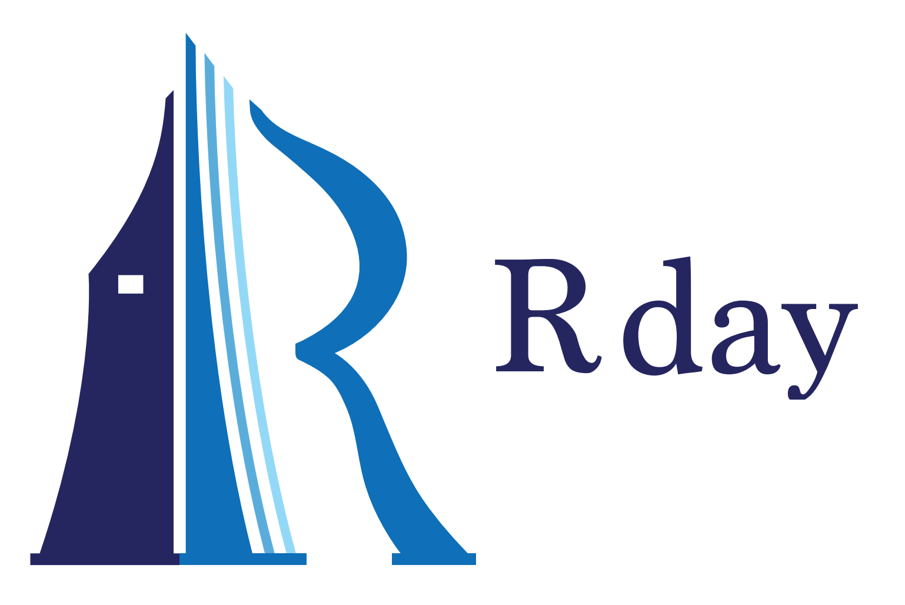
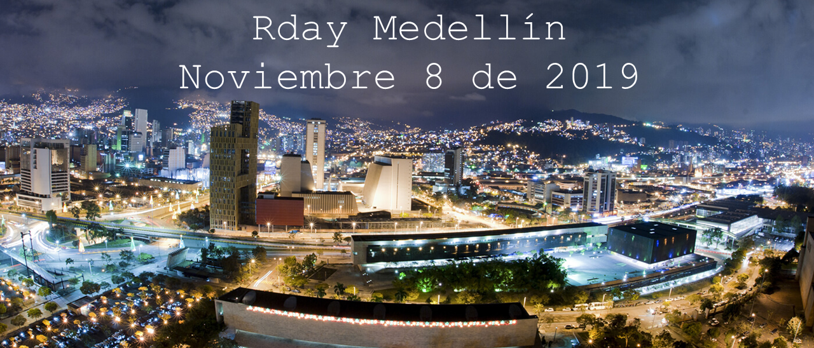

<h2> </h2>

R Day es un evento que ha tenido un impacto positivo en la comunidad científica y empresarial debido a la versatilidad del lenguaje de programación R para estadística y ciencia de datos. Este evento se ha realizado en diferentes ciudades del mundo, y en esta ocasión, se realizará por segunda vez en Medellín de forma **presencial**. Con el Rday queremos integrar la comunidad de usuarios de R en la ciudad de Medellín y llamar la atención de quienes aún no lo conocen.

Visite [este enlace](https://rday-colombia.github.io/2023/inscripciones.html){target="_blank"} para hacer la inscripción al R Day 2023.

 
 

<h1> Organizan </h1>

     
 
 
 
     
<h1> Apoyan </h1>

     
 
     

     

