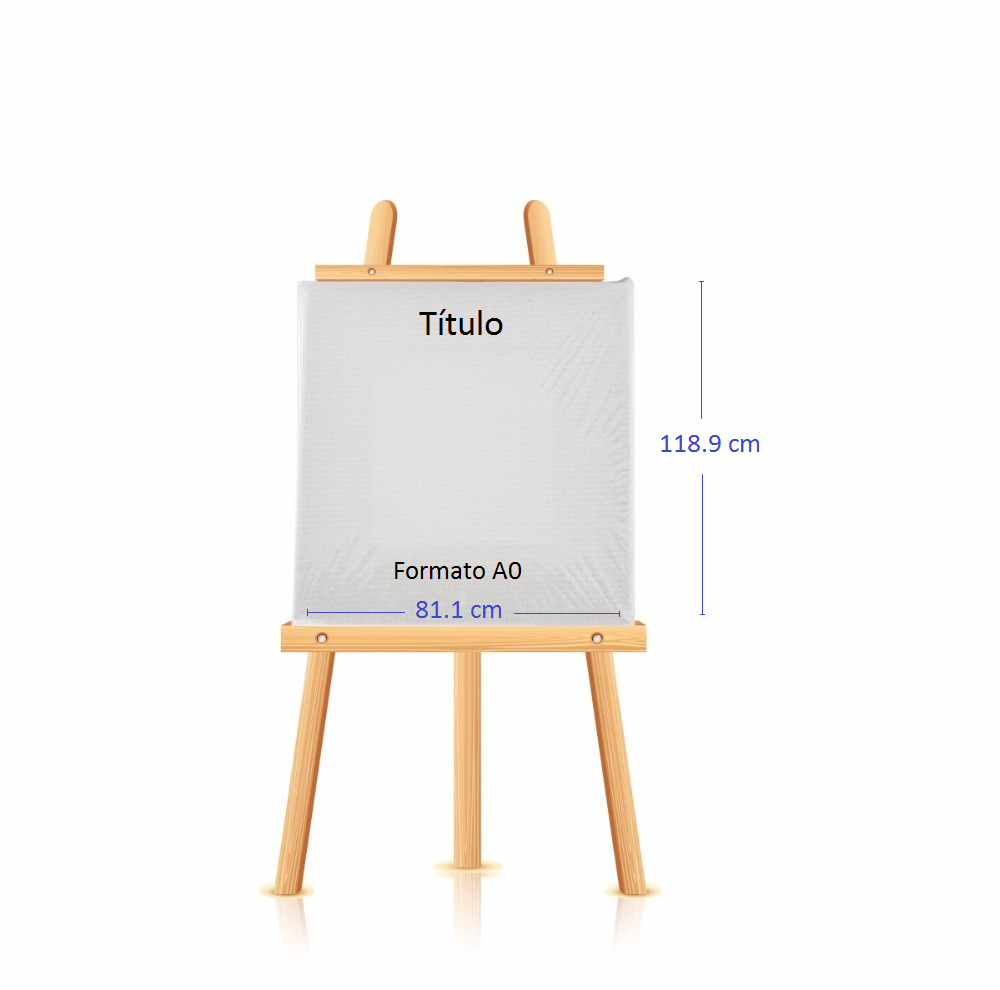

Son bienvenidos todos los trabajos en los cuales se haya usado R en la metodología del mismo. La presentación de los trabajos se puede realizar de dos formas:

- Póster (60 minutos).
- Comunicación (10 minutos para presentación y 5 minutos para preguntas).

El sometimiento de trabajos para el Rday se realiza únicamente por medio de la herramienta [EasyChair](https://easychair.org/).

 La fecha límite para presentar los resúmenes se amplió, visite [este enlace](https://rdaymedellin.github.io/fechas.html) para conocer la nueva fecha.

 

## Proceso

El proceso para someter un trabajo es el siguiente:

1. Visitar la página [https://easychair.org/conferences/?conf=rday2019](https://easychair.org/conferences/?conf=rday2019) y crear una cuenta o membresía.
1. Visitar nuevamente la página [https://easychair.org/conferences/?conf=rday2019](https://easychair.org/conferences/?conf=rday2019) e ingresar con sus datos de cuenta.
1. Dar clic en el hiperenlace __author__ para acceder como autor.
1. Dar clic en el botón __New submission__.
1. Ingresar la información de cada uno de los autores y seleccionar el autor de correspondencia.
1. Ingresar un título para el trabajo en el cajón __Title__.
1. Ingresar un resumen del trabajo en el cajón __Abstract__.
1. Escribir al menos tres (3) palabras clave en el cajón __Keywords__, una por renglón.
1. Adjuntar su trabajo en formato pdf usando la plantilla exigida. Se recomienda que este archivo tenga un extensión máxima de cuatro (4) páginas.
1. Oprimir el boton __Submit__ una sola vez para someter su trabajo.

Una vez sometido el trabajo usted deberá esperar hasta la fecha de notificación (aceptacióno o rechazo) de trabajos. Las fechas se encuentra [en este enlace](https://rdaymedellin.github.io/fechas.html).

<iframe width="560" height="315" src="https://www.youtube.com/embed/Q5onax2i6VM" frameborder="0" allow="accelerometer; autoplay; encrypted-media; gyroscope; picture-in-picture" allowfullscreen></iframe>

 

## Formatos sugeridos
A continuación se encuentran los formatos sugeridos para la elaboración de los trabajos, el póster y la presentación.

- Los trabajos sometidos **deben** tener [este formato](https://rdaymedellin.github.io/documentos/Plantilla_trabajos_Rday_2019/Plantilla_trabajos_Rday.pdf) y los archivos necesarios para crear la propuesta se encuentran [en este enlace](https://rdaymedellin.github.io/documentos/Plantilla_trabajos_Rday_2019.zip).
- Para las diapositivas se recomienda usar [este formato](https://rdaymedellin.github.io/documentos/Plantilla_presentacion_Rday_2019/Plantilla_presentacion_Rday_2019.pdf) y los archivos para crear las diapositivas se encuentran [en este enlace](https://rdaymedellin.github.io/documentos/Plantilla_presentacion_Rday_2019.zip).
- El formato para el póster es libre pero debe ser en orientación vertical con las dimensiones sugeridas en la siguiente figura.

## Memorias
Todos los trabajos presentados (comunicaciones y pósteres) serán incluídos en las [memorias](https://rdaymedellin.github.io/documentos/Memorias/Memorias_Rday_Medellin.pdf) del evento.

